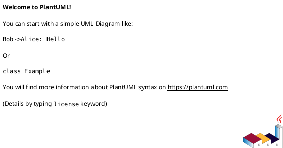

# EduAI — Diagrammes UML

> **Projet** : EduAI — Plateforme d'assistance pédagogique par IA  
> **Stack** : FastAPI · Next.js 14 · MongoDB · FAISS · Groq (llama-3.3-70b) · Docker  
> **Date** : Mai 2026

---

## Table des matières

1. [Analyse du projet](#1-analyse-du-projet)
2. [Diagramme de Cas d'Utilisation](#2-diagramme-de-cas-dutilisation)
3. [Diagrammes de Séquence](#3-diagrammes-de-séquence)
   - [Séquence 1 — Inscription & Connexion](#séquence-1--inscription--connexion)
   - [Séquence 2 — Upload & Indexation d'un cours PDF](#séquence-2--upload--indexation-dun-cours-pdf)
   - [Séquence 3 — Session Questions-Réponses (RAG)](#séquence-3--session-questions-réponses-rag)
   - [Séquence 4 — Génération de Résumé Pédagogique](#séquence-4--génération-de-résumé-pédagogique)
   - [Séquence 5 — Génération & Soumission de Quiz](#séquence-5--génération--soumission-de-quiz)

---

## 1. Analyse du projet

### Architecture globale

```
┌─────────────────────────────────────────────────────────────────┐
│                        Client (Browser)                         │
│                     Next.js 14 — Port 3000                      │
│   Pages: /, /auth, /course/[id], /upload           │
└─────────────────────────┬───────────────────────────────────────┘
                          │ HTTP (Docker network: eduai_internal)
                          ▼
┌─────────────────────────────────────────────────────────────────┐
│                    FastAPI Backend — Port 8000                   │
│                                                                 │
│  /api/auth      → Inscription, Connexion, Profil (JWT HS256)   │
│  /api/courses   → Upload PDF, Liste, Détail, Suppression       │
│  /api/qa        → Questions-Réponses (RAG conversationnel)     │
│  /api/summary   → Résumés pédagogiques par chapitre            │
│  /api/quiz      → Quiz QCM générés par LLM                     │
│  /api/flashcards→ Flashcards + révision espacée (SM-2)         │
│  /api/mindmap   → Mind Map conceptuelle                        │
│  /api/exam      → Examen simulé chronométré                    │
│  /api/export    → Export PDF des résumés et flashcards         │
└──────┬─────────────────────┬────────────────────────────────────┘
       │                     │
       ▼                     ▼
┌─────────────┐     ┌───────────────────────────────────────────┐
│  MongoDB    │     │          Pipeline NLP + DL                │
│  mongo:7    │     │                                           │
│             │     │  1. PyMuPDF  — Extraction texte PDF      │
│  Collections│     │  2. Chunker  — Découpage NLP (500 tok)   │
│  - users    │     │  3. spaCy    — NER, POS, lemmatisation   │
│  - courses  │     │  4. MiniLM   — Embeddings 384-d (BERT)  │
│  - chunks   │     │  5. FAISS    — Index vectoriel (FlatIP)  │
│  - qa_hist  │     │  6. TextRank — Résumé extractif          │
│  - summaries│     │  7. CamemBERT— QA extractif (fallback)  │
│  - quizzes  │     │  8. Groq LLM — Génération générative     │
│  - flashcards│    │              llama-3.3-70b-versatile      │
│  - mindmaps │     └───────────────────────────────────────────┘
└─────────────┘
```

### Acteurs identifiés

| Acteur       | Type                   | Rôle                                                |
| ------------ | ---------------------- | --------------------------------------------------- |
| **Étudiant** | Acteur principal       | Utilise toutes les fonctionnalités de la plateforme |
| **Groq LLM** | Acteur système externe | Génère réponses, résumés, quiz, flashcards          |
| **MongoDB**  | Acteur système         | Persiste toutes les données (users, cours, cache)   |
| **FAISS**    | Acteur système         | Index vectoriel pour la recherche sémantique        |

### Cas d'utilisation identifiés (9 domaines)

| #   | Domaine            | Cas d'utilisation principaux                 |
| --- | ------------------ | -------------------------------------------- |
| 1   | Authentification   | Inscription, Connexion, Profil, JWT          |
| 2   | Gestion des cours  | Upload PDF, Liste, Détail, Suppression       |
| 3   | Questions-Réponses | Poser question, Réponse RAG, Historique      |
| 4   | Résumés            | Génération, Export PDF                       |
| 5   | Quiz               | Génération QCM, Soumission, Résultats        |
| 6   | Flashcards         | Génération, Révision SM-2, Export PDF        |
| 7   | Mind Map           | Génération carte conceptuelle                |
| 8   | Examen simulé      | Démarrage, Soumission, Score A-F, Historique |

---

## 2. Diagramme de Cas d'Utilisation

> **Fichier source PlantUML** : [UML_UseCase.puml](./UML_UseCase.puml)  
> Rendu avec PlantUML v1.2024+, thème `plain`.



### Vue textuelle structurée

```
╔══════════════════════════════════════════════════════════════════════╗
║                        SYSTÈME EduAI                               ║
║                                                                    ║
║  ┌─ 1. AUTHENTIFICATION ──────────────────────────────────────┐    ║
║  │  UC1  S'inscrire              ──►  <<include>> Bcrypt       │    ║
║  │  UC2  Se connecter            ──►  <<include>> JWT          │    ║
║  │  UC3  Consulter profil                                       │    ║
║  └────────────────────────────────────────────────────────────┘    ║
║                                                                    ║
║  ┌─ 2. GESTION DES COURS ──────────────────────────────────────┐   ║
║  │  UC4  Uploader un cours PDF   ──►  Extract → Chunk →        │   ║
║  │                                    Embed → FAISS Index       │   ║
║  │  UC5  Lister ses cours                                       │   ║
║  │  UC6  Voir détail d'un cours                                 │   ║
║  │  UC7  Supprimer un cours                                     │   ║
║  └────────────────────────────────────────────────────────────┘   ║
║                                                                    ║
║  ┌─ 3. QUESTIONS-RÉPONSES (RAG) ───────────────────────────────┐   ║
║  │  UC8  Poser une question       ──►  Embed Q → FAISS →       │   ║
║  │                                     LLM / CamemBERT         │   ║
║  │  UC9  Voir historique Q&A                                    │   ║
║  └────────────────────────────────────────────────────────────┘   ║
║                                                                    ║
║  ┌─ 4. RÉSUMÉS ────────────────────────────────────────────────┐   ║
║  │  UC10 Générer résumé           ──►  TextRank + Groq LLM     │   ║
║  │  UC11 Exporter résumé PDF                                    │   ║
║  └────────────────────────────────────────────────────────────┘   ║
║                                                                    ║
║  ┌─ 5. QUIZ ───────────────────────────────────────────────────┐   ║
║  │  UC12 Générer quiz QCM         ──►  Groq LLM                │   ║
║  │  UC13 Soumettre + voir résultats                             │   ║
║  └────────────────────────────────────────────────────────────┘   ║
║                                                                    ║
║  ┌─ 6. FLASHCARDS ─────────────────────────────────────────────┐   ║
║  │  UC14 Générer flashcards                                     │   ║
║  │  UC15 Réviser (algorithme SM-2)                              │   ║
║  └────────────────────────────────────────────────────────────┘   ║
║                                                                    ║
║  ┌─ 7. MIND MAP ───────────────────────────────────────────────┐   ║
║  │  UC16 Générer mind map du cours                              │   ║
║  └────────────────────────────────────────────────────────────┘   ║
║                                                                    ║
║  ┌─ 8. EXAMEN SIMULÉ ──────────────────────────────────────────┐   ║
║  │  UC17 Démarrer examen (avec timer)                           │   ║
║  │  UC18 Soumettre + voir note (A–F)                            │   ║
║  │  UC19 Consulter historique d'examens                         │   ║
║  └────────────────────────────────────────────────────────────┘   ║
║                                                                    ║
╚══════════════════════════════════════════════════════════════════════╝

[Étudiant] ──────► UC1 ... UC19 (tous les cas ci-dessus)
[Groq LLM] ◄────── UC8(réponse), UC10(résumé), UC12(quiz), UC14(flashcards), UC17(exam)
[MongoDB]  ◄────── UC1,4,5,6,7,8,9,10,12,14,16,17,18,19
[FAISS]    ◄────── UC4(indexation), UC8(recherche)
```

---

## 3. Diagrammes de Séquence

---

### Séquence 1 — Inscription & Connexion

> **Fichier source** : [UML_Sequence_Auth.puml](./UML_Sequence_Auth.puml)

**Participants** : Étudiant → Frontend (Next.js) → Backend (FastAPI) → AuthService (JWT+bcrypt) → MongoDB

**Flot principal — Inscription** :

```
Étudiant          Frontend        Backend         AuthService      MongoDB
   │                 │               │                 │              │
   │ Remplit form    │               │                 │              │
   │────────────────►│               │                 │              │
   │                 │ POST /register│                 │              │
   │                 │──────────────►│                 │              │
   │                 │               │ Valide Pydantic │              │
   │                 │               │────────────────────────────────►│
   │                 │               │◄──────────────────────────────── null
   │                 │               │ hash_password(pwd[:72])         │
   │                 │               │────────────────►│               │
   │                 │               │◄────────────────│ bcrypt hash   │
   │                 │               │ insert_one(user)────────────────►│
   │                 │               │◄──────────────────────────────── user_id
   │                 │               │ create_access_token(user_id)    │
   │                 │               │────────────────►│               │
   │                 │               │◄────────────────│ JWT (7 jours) │
   │                 │ 201 {token}   │                 │               │
   │                 │◄──────────────│                 │               │
   │ Dashboard       │               │                 │               │
   │◄────────────────│               │                 │               │
```

**Flot — Vérification JWT (middleware)** :

```
Request avec Bearer token
   │ GET /api/... Authorization: Bearer <JWT>
   ├─► Backend → jwt.decode(token, SECRET_KEY, HS256)
   │     ├─ Valide → {"user_id": "...", "email": "..."}  ✓  continue
   │     └─ Invalide/expiré → 401 Unauthorized           ✗  rejeté
```

---

### Séquence 2 — Upload & Indexation d'un cours PDF

> **Fichier source** : [UML_Sequence_Upload.puml](./UML_Sequence_Upload.puml)

**Participants** : Étudiant → Frontend → Backend → PDF Extractor → Chunker → Embedder → FAISS → MongoDB → LLM

**Pipeline complet** :

```
POST /api/courses/upload (multipart/form-data)
           │
           ▼
    [JWT validation]
           │
           ▼
    [Quota check: count < 20 ?]
           │
           ▼
    [Validation: .pdf, taille ≤ 50 MB]
           │
           ▼
    PyMuPDF: extract_pdf(bytes)
    → page_blocks [{page_num, text}]
           │
           ▼
    Chunker: create_chunks(blocks, size=500, overlap=50)
    → chunks [{text, page, chapter}]
           │
           ▼
    MongoDB: insert_one(course, status="processing")
    MongoDB: insert_many(chunks)
           │
           ▼
    ← 200 OK (réponse immédiate)
           │
    [Tâche arrière-plan asyncio]
           │
           ▼
    Embedder: embed_texts(texts)   ← MiniLM BERT 384-d
    → embeddings matrix (N × 384)
           │
           ▼
    FAISS: create_index(course_id, embeddings)
    → /data/faiss_indexes/{course_id}.faiss
           │
           ▼
    MongoDB: update_status("ready")
           │
           ▼
    [Pré-génération background]
    ├─ Groq LLM: fiches pédagogiques → cache MongoDB (summaries)
    └─ Groq LLM: 10 QCM → cache MongoDB (quizzes)
```

---

### Séquence 3 — Session Questions-Réponses (RAG)

> **Fichier source** : [UML_Sequence_QA.puml](./UML_Sequence_QA.puml)

**Participants** : Étudiant → Frontend → Backend → Embedder → FAISS → MongoDB → Groq LLM / CamemBERT

**Pipeline RAG détaillé** :

```
POST /api/qa/ask
{"course_id": "...", "question": "Qu'est-ce qu'une convolution ?", "session_id": "..."}
                    │
                    ▼
             [JWT validation]
                    │
                    ▼
             MongoDB: get_course + get_chunks(course_id)
                    │
                    ▼
        ┌─────────────────────────────┐
        │  ÉTAPE 1 : ENCODAGE         │
        │  MiniLM: embed_query(Q)     │
        │  → query_vector [384]       │
        └──────────────┬──────────────┘
                       │
                       ▼
        ┌─────────────────────────────┐
        │  ÉTAPE 2 : RETRIEVAL        │
        │  FAISS: search(course_id,   │
        │    query_vec, k=top_k)      │
        │  → [{index, score}]         │
        │  Filtre: score ≥ 0.30       │
        └──────────────┬──────────────┘
                       │
                       ▼
        ┌─────────────────────────────┐
        │  ÉTAPE 3 : HISTORIQUE       │
        │  MongoDB: get_qa_history    │
        │  → 3 derniers échanges      │
        └──────────────┬──────────────┘
                       │
                       ▼
        ┌─────────────────────────────────────────┐
        │  ÉTAPE 4 : GÉNÉRATION                   │
        │                                         │
        │  [LLM disponible]                       │
        │  Groq: answer_with_llm(                 │
        │    question, context, title, history)   │
        │  → {answer, sources[], llm_used=true}   │
        │                                         │
        │  [LLM indisponible — fallback]          │
        │  CamemBERT: answer_question(Q, context) │
        │  → {answer, confidence, llm_used=false} │
        └──────────────┬──────────────────────────┘
                       │
                       ▼
        MongoDB: save_qa_exchange(session_id, Q, A, sources)
                       │
                       ▼
        Response 200:
        {
          "answer": "...",
          "confidence": 0.92,
          "sources": [{"chunk_text","page","chapter","score"}],
          "session_id": "uuid",
          "llm_used": true
        }
```

---

### Séquence 4 — Génération de Résumé Pédagogique

> **Fichier source** : [UML_Sequence_Summary.puml](./UML_Sequence_Summary.puml)

**Participants** : Étudiant → Frontend → Backend → spaCy → TextRank → Groq LLM → MongoDB

**Pipeline NLP + DL + LLM** :

```
GET /api/summary/{course_id}
            │
            ▼
     [JWT validation]
            │
            ▼
     MongoDB: get_cached_summary ?
     ├─ Cache HIT  → réponse immédiate ✓
     └─ Cache MISS ─────────────────────►
                    │
                    ▼
            get_chunks(course_id)
                    │
            ┌───────┴────────────────────────────┐
            │                                    │
            ▼                                    │
     ÉTAPE 1: spaCy fr_core_news_lg              │
     - Tokenisation, POS-tagging                 │
     - Named Entity Recognition (NER)            │
     - Lemmatisation                             │
     - Extraction concepts clés                  │
     → {entities, key_concepts, scored_sentences}│
            │                                    │
            ▼                                    │
     ÉTAPE 2: TextRank (résumé extractif)        │
     - Graph cosine similarity entre phrases     │
     - Sélection top-N phrases par chapitre      │
     → [{title, summary, pages, key_concepts}]   │
            │                                    │
            ▼                                    │
     ÉTAPE 3: Groq LLM (fiche pédagogique)       │
     Pour chaque chapitre:                       │
     - Reformulation narrative                   │
     - Titre accrocheur                          │
     - Objectifs d'apprentissage                 │
     → pedagogic: str (Markdown)                 │
            │                                    │
            ▼                                    │
     MongoDB: save_cached_summary(course_id)     │
            │                                    │
            └─────────────────────────────────── ┘
            │
            ▼
     Response 200: SummaryResponse {
       chapters: [{
         title, summary, pedagogic, key_concepts,
         llm_used, techniques, pages
       }],
       pipeline_meta: {
         steps: [Extraction→spaCy→MiniLM→FAISS→TextRank→Groq],
         llm_backend: "groq",
         llm_model: "llama-3.3-70b-versatile"
       }
     }
```

---

### Séquence 5 — Génération & Soumission de Quiz

> **Fichier source** : [UML_Sequence_Quiz.puml](./UML_Sequence_Quiz.puml)

**Participants** : Étudiant → Frontend → Backend → Groq LLM → MongoDB

**Flot de génération** :

```
GET /api/quiz/{course_id}?num_questions=10
              │
              ▼
       [JWT validation]
              │
       MongoDB: get_cached_course_quiz ?
       ├─ Cache HIT  → QuizResponse immédiate ✓
       └─ Cache MISS ──────────────────────────►
                       │
                       ▼
               get_chunks(course_id)
                       │
                       ▼
               Groq LLM: generate_quiz_llm(chunks, n=10)
               Prompt: génère 10 QCM français
               - 4 options par question
               - Niveau facile/moyen/difficile
               - Explication bonne réponse
               - Référence au chunk source
                       │
               ├─ LLM OK  → save_quiz + cache ✓
               └─ LLM KO  → 503 (pas de fallback)
                       │
                       ▼
               Response: QuizResponse {
                 quiz_id: "uuid",
                 questions: [{
                   id, question, options[4],
                   correct_index, explanation,
                   source_chunk, difficulty
                 }]
               }
```

**Flot de soumission** :

```
POST /api/quiz/{quiz_id}/submit
{"quiz_id":"...","answers":[0,2,1,3,...]}
              │
              ▼
       MongoDB: get_quiz(quiz_id)  → questions + correct_index
              │
              ▼
       Calcul score: compare answers[i] == questions[i].correct_index
              │
              ▼
       MongoDB: save quiz result
              │
              ▼
       Response: QuizResult {
         score: 7, total: 10, percentage: 70.0,
         details: [{question, correct, correct_answer, explanation}]
       }
```

---

## Conventions UML utilisées

| Notation      | Signification                         |
| ------------- | ------------------------------------- |
| `──────►`     | Message synchrone                     |
| `- - - ►`     | Message de retour                     |
| `<<include>>` | Relation d'inclusion (obligatoire)    |
| `<<extend>>`  | Relation d'extension (conditionnelle) |
| `alt / else`  | Fragment combiné alternatif           |
| `loop`        | Fragment répétitif                    |
| `[condition]` | Garde d'un fragment                   |

---

## Fichiers source PlantUML

| Fichier                                                                      | Contenu                                  |
| ---------------------------------------------------------------------------- | ---------------------------------------- |
| [UML_UseCase.puml](./UML_UseCase.puml)                                       | Vue d'ensemble (8 domaines)              |
| [UML_UseCase_P1_Auth_Cours.puml](./UML_UseCase_P1_Auth_Cours.puml)           | Authentification + Gestion Cours         |
| [UML_UseCase_P2_QA_Resume.puml](./UML_UseCase_P2_QA_Resume.puml)             | Q&A RAG + Résumés Pédagogiques           |
| [UML_UseCase_P3_Quiz_Flash_Mind.puml](./UML_UseCase_P3_Quiz_Flash_Mind.puml) | Quiz + Flashcards SM-2 + Mind Map        |
| [UML_UseCase_P4_Exam_Analytics.puml](./UML_UseCase_P4_Exam_Analytics.puml)   | Examen Simulé                            |
| [UML_Sequence_Auth.puml](./UML_Sequence_Auth.puml)                           | Inscription + Connexion + JWT middleware |
| [UML_Sequence_Upload.puml](./UML_Sequence_Upload.puml)                       | Upload PDF + pipeline d'indexation       |
| [UML_Sequence_QA.puml](./UML_Sequence_QA.puml)                               | Session Q&A (pipeline RAG complet)       |
| [UML_Sequence_Summary.puml](./UML_Sequence_Summary.puml)                     | Génération de résumé + Export PDF        |
| [UML_Sequence_Quiz.puml](./UML_Sequence_Quiz.puml)                           | Génération + soumission de quiz          |

> **Rendu** : Ouvrir les fichiers `.puml` avec l'extension VS Code **PlantUML** (`jebbs.plantuml`) ou sur [plantuml.com/plantuml](https://www.plantuml.com/plantuml/uml).
